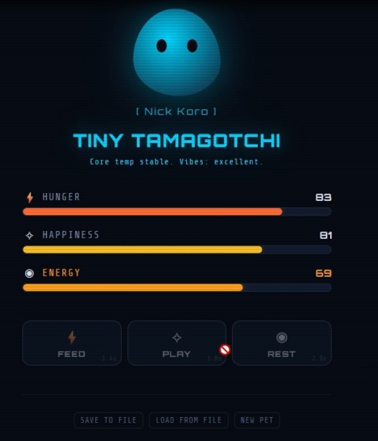
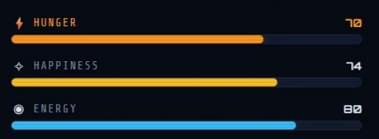
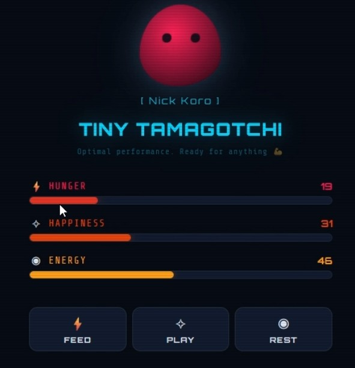
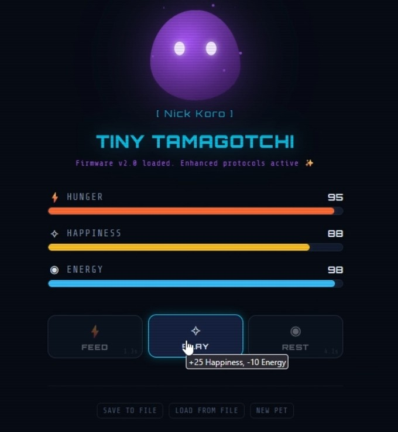
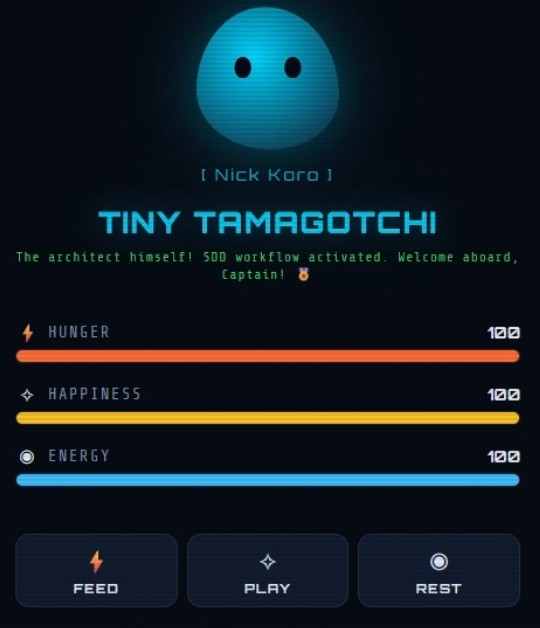
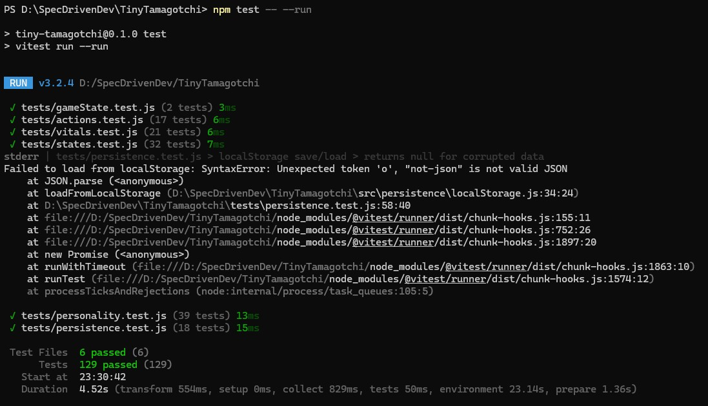
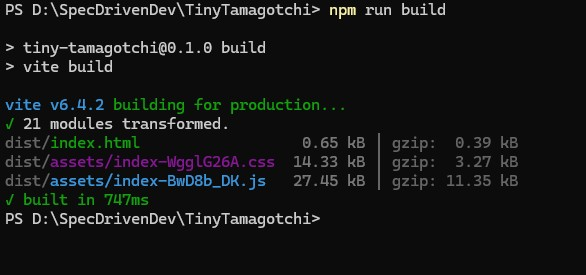

# Tiny Tamagotchi 🐾

A virtual pet web app built with **Spec-Driven Development** — where the specification is the primary artifact, and the code follows.

[](https://nickkoro21.github.io/Tiny-Tamagotchi/) [](https://community.deeplearning.ai/t/7-day-challenge-tamagotchi-challenge-winners/891943) [](./LICENSE) [](https://preactjs.com/) [](https://vitejs.dev/) [](https://vitest.dev/) [](./tests) [](https://github.com/Nickkoro21/Tiny-Tamagotchi/actions/workflows/deploy.yml)

> Built for the [DeepLearning.AI 7-Day Learner Challenge](https://community.deeplearning.ai/t/7-day-learner-challenge-tiny-tamagotchi-mvp-with-spec-driven-development/891489) (Spec-Driven Development with Coding Agents course).

🥉 **Awarded 3rd place** in the [DeepLearning.AI 7-Day Spec-Driven Dev Challenge](https://community.deeplearning.ai/t/7-day-challenge-tamagotchi-challenge-winners/891943) — try the [live demo](https://nickkoro21.github.io/Tiny-Tamagotchi/) or [watch the walkthrough](https://1drv.ms/v/c/ff86a1b8b4e7e459/IQDbV2FWswfkSLguL2nBirRSAZDuDDtiYuIX9B8qEKl0wNo?e=JUF0YB).

## 🎮 Live Demo

### ▶️ Play it in your browser

**👉 [https://nickkoro21.github.io/Tiny-Tamagotchi/](https://nickkoro21.github.io/Tiny-Tamagotchi/)**

No install, no clone — just open the link, name your pet, and start caring. State persists in `localStorage` across reloads.

### 🏆 Recognition

This project earned **3rd place** in the [DeepLearning.AI 7-Day Spec-Driven Development Challenge](https://community.deeplearning.ai/t/7-day-challenge-tamagotchi-challenge-winners/891943) (May 2026), with a final score of **6.48 / 7.00**. The reviewer feedback called the submission *"a standout submission — the precision, structural discipline, and edge-case thinking on display here reflect the habits of an experienced spec writer, not a beginner."*

### 🎥 Video Walkthrough

**▶️ [Watch the walkthrough on OneDrive](https://1drv.ms/v/c/ff86a1b8b4e7e459/IQDbV2FWswfkSLguL2nBirRSAZDuDDtiYuIX9B8qEKl0wNo?e=JUF0YB)**

The video covers:
- Naming a pet (including an easter-egg name reveal)
- Real-time vitals decay (Hunger / Happiness / Energy at different rates)
- The care loop — Feed, Play, Rest — and their cooldowns
- The state machine: Normal → Sick recovery, then Normal → Evolved progression
- Personality messages cycling, including combo reactions and milestone pops
- The SDD workflow — specs driving every feature, not the other way around

### 📸 At a glance



_The main game view: Hunger / Happiness / Energy bars with live decay, care action buttons, and a cycling personality message above the blob._

### 🖥 Run it yourself

Local setup in [Setup](#-setup) below — `npm install && npm run dev` → `http://localhost:5173`.

## ✨ Features — The Four Pillars

### 1. Living Vitals
Three stats (Hunger, Happiness, Energy) on a 0–100 scale that decay automatically in real time at different rates — **Hunger fastest (~30 s), Happiness mid (~35 s), Energy slowest (~45 s)**. Visual color feedback shifts from healthy → warning → low → critical as stats drop.



_Stat bars shift color as values cross thresholds — here one stat has dropped into the warning band._

### 2. The Care Loop
Three actions — **Feed** (+30 hunger / +5 happiness), **Play** (+25 happiness / −10 energy), **Rest** (+35 energy / +5 happiness) — each with its own cooldown (3–5 s). Pet naming on first launch. State persists via `localStorage` with JSON export/import backup.

### 3. Dynamic States
The pet transitions between three visual states with distinct decay modifiers:

| State       | Trigger                                              | Decay | Visual                                      |
|-------------|------------------------------------------------------|-------|---------------------------------------------|
| **Normal**  | Default healthy state                                | ×1.0  | Cyan glow, smooth idle animation            |
| **Sick**    | Any stat drops below 20                              | ×1.5  | Red glitch effect, distorted shape          |
| **Evolved** | 6+ care actions **AND** all stats > 70 for 15 s     | ×0.7  | Purple glow, shimmer particles, bright eyes |

Evolved pets can regress to Sick if neglected — there's no direct Evolved → Normal path. After recovering from Sick, evolution must be re-earned.



_The Sick state — red danger tint, glitch animation, and accelerated decay._



_The Evolved state — purple glow, shimmer particles, and slower decay as the reward for sustained care._

### 4. Personal Touches
- **Tech-themed personality messages** cycling every 5 seconds, priority-ranked (milestones > state > combos > low-stat warnings > rare > ambient)
- **Context-aware reactions** for stat combinations (e.g., `Hungry + Tired`, `Full but Sad`, `All Critical = MAYDAY`)
- **11 easter-egg names** across three themes (case-insensitive):
  - **Sci-fi (4):** HAL, Jarvis, Cortana, R2D2
  - **Aviation (4):** Maverick, Goose, Iceman, Viper
  - **Personal (3):** Nick, Koro, Nick Koro
- **Milestone celebrations** at 10, 25, 50, and 100 care actions (each shown once)
- **Rare random messages** (5% chance when all stats > 50)



_Name your pet `Nick Koro`, `Maverick`, `HAL`, or any of the 11 recognised names for a themed greeting._

## 🛠️ Tech Stack

| Layer | Technology | Rationale |
|-------|-----------|-----------|
| UI Framework | Preact ^10.x | 3 KB runtime, React-compatible API — lightweight for an MVP |
| Build Tool | Vite ^6.x | Instant dev server, zero-config HMR, fast builds |
| Styling | Vanilla CSS (custom properties) | No framework lock-in, full theme control via CSS variables |
| Testing | Vitest ^3.x | Native Vite integration, Jest-compatible API, first-class ESM |
| Language | JavaScript (ES2022+, JSX) | No transpile cost beyond Vite; modern syntax without a type-checker in the loop |
| Persistence | localStorage + JSON export/import | Client-only — no backend needed for a single-user MVP |

> **Why this stack?** Each choice was made to minimize MVP complexity while keeping the door open for later upgrades (e.g., swapping Preact for React, or localStorage for IndexedDB). Nothing here blocks scale; everything here accelerates shipping.

## 📂 Project Structure

```
TinyTamagotchi/
├── specs/                          # SDD Constitution
│   ├── mission.md                  #   Vision, audience, scope
│   ├── tech-stack.md               #   Architecture decisions
│   └── roadmap.md                  #   Development phases
├── feature-01-living-vitals/       # Feature specs (per phase) — same 3-file SDD structure
│   ├── feature-plan.md             #     Task groups, approach, sequence
│   ├── requirements.md             #     Functional + non-functional reqs
│   └── validation.md               #     Unit tests + manual checklist
├── feature-02-care-loop/
│   ├── feature-plan.md
│   ├── requirements.md
│   └── validation.md
├── feature-03-dynamic-states/
│   ├── feature-plan.md
│   ├── requirements.md
│   └── validation.md
├── feature-04-personal-touches/
│   ├── feature-plan.md
│   ├── requirements.md
│   └── validation.md
├── src/
│   ├── engine/                     # Pure game logic (no UI)
│   │   ├── gameState.js            #     State shape + factory
│   │   ├── vitals.js               #     Decay + actions + clamps
│   │   ├── states.js               #     Normal/Sick/Evolved state machine
│   │   └── personality.js          #     Messages, easter eggs, milestones
│   ├── components/                 # Preact UI components
│   ├── persistence/                # Save/load (localStorage + JSON)
│   └── styles/                     # CSS (dark sci-fi theme)
├── tests/                          # Vitest unit tests
└── package.json
```

## 🚀 Setup

```bash
# Clone the repo
git clone https://github.com/Nickkoro21/Tiny-Tamagotchi.git
cd Tiny-Tamagotchi

# Install dependencies
npm install

# Start dev server
npm run dev
# → Open http://localhost:5173

# Run tests
npm run test
```

## 📐 SDD Workflow

This project follows the **Spec-Driven Development** workflow:

1. **Constitution** — Define mission, tech stack, and roadmap
2. **Feature Loop** (per feature):
   - **Plan** → `feature-plan.md`
   - **Requirements** → `requirements.md`
   - **Validation** → `validation.md`
   - **Implement** → write code following specs
   - **Validate** → run tests, manual checks
3. **Replan** — review and update between features

The specs are the **primary artifact** — they capture every decision and drive the implementation.

## 📊 Spec Quality

Snapshot of the spec-driven output at submission time:

| Metric | Value |
|--------|------:|
| Constitution docs | 3 (mission, tech-stack, roadmap) |
| Feature specs | 12 (4 features × plan / requirements / validation) |
| Total spec files | **15** |
| Unit tests | **129** (6 suites: vitals, actions, states, personality, persistence, gameState) |
| Engine modules | 4 (gameState, vitals, states, personality) |
| Testing levels | 2 (automated Vitest + manual validation checklists per feature) |
| Easter-egg names | 11 (across sci-fi / aviation / personal themes) |
| Milestones | 4 (10 / 25 / 50 / 100 care actions) |
| Dynamic states | 3 (Normal / Sick / Evolved) with distinct decay multipliers |

## 🧪 Testing & Quality Evidence

- **Unit tests:** 129 tests across 6 suites — covering vitals decay, care actions, state transitions, personality messages, easter eggs, milestones, and persistence
- **Manual validation:** Checklists in each feature's `validation.md` (message variety, state transitions, easter eggs, responsive layout, persistence round-trips)
- **Two levels of difficulty:** Automated (Vitest) + manual (visual / interaction checks)

```bash
npm run test
```



_All 129 tests green — evidence that the validation strategies in each `validation.md` are executable and passing._



_Clean production build — no errors, no warnings._

## 📋 Challenge Submission

- **Challenge:** DeepLearning.AI 7-Day Learner Challenge
- **Course:** Spec-Driven Development with Coding Agents
- **Deadline:** April 22, 2026 — 11:59 PM PST

## 🙏 Contributors & Acknowledgments

- **[Paul Everitt](https://x.com/paulweveritt)** — Developer Advocate at JetBrains, instructor of the [Spec-Driven Development with Coding Agents](https://learn.deeplearning.ai/courses/spec-driven-development-with-coding-agents/information) short course. The constitution / feature-loop / replan workflow applied throughout this project is his.
- **[JetBrains](https://www.jetbrains.com/)** × **[DeepLearning.AI](https://www.deeplearning.ai/)** — for building and hosting the course and the accompanying [7-Day Learner Challenge](https://community.deeplearning.ai/t/7-day-learner-challenge-tiny-tamagotchi-mvp-with-spec-driven-development/891489).
- **[Claude (Anthropic)](https://www.anthropic.com/claude)** — AI pair programmer. Drafted specs, implemented features, and surfaced edge cases under human-in-the-loop review at every step — true to the SDD ethos that the human is the architect and the agent is the muscle.

---

### Author

**Nikolaos Koroniadis**

[](https://www.linkedin.com/in/nick-koroniadis-328962226/) [](https://github.com/Nickkoro21)

MSc Candidate — Geography and Applied Geoinformatics  
University of the Aegean

## 📄 License

MIT — see [LICENSE](./LICENSE).
